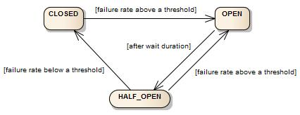

= Fault tolerance library designed for functional programming
:author: Robert Winkler and Bohdan Storozhuk
:hardbreaks:

image:https://travis-ci.org/RobWin/javaslang-circuitbreaker.svg?branch=master["Build Status", link="https://travis-ci.org/RobWin/javaslang-circuitbreaker"] image:https://coveralls.io/repos/github/RobWin/javaslang-circuitbreaker/badge.svg?branch=master["Coverage Status", link="https://coveralls.io/github/RobWin/javaslang-circuitbreaker?branch=master"] image:https://api.bintray.com/packages/robwin/maven/javaslang-circuitbreaker/images/download.svg[link="https://bintray.com/robwin/maven/javaslang-circuitbreaker/_latestVersion"] image:http://img.shields.io/badge/license-ASF2-blue.svg["Apache License 2", link="http://www.apache.org/licenses/LICENSE-2.0.txt"]

This library is a lightweight, easy-to-use fault tolerance library inspired by https://github.com/Netflix/Hystrix[Netflix Hystrix], but designed for Java 8 and functional programming. Lightweight, because the library only uses https://github.com/javaslang/javaslang[Javaslang], https://github.com/ReactiveX/RxJava[RxJava] and SLF4J-API, which do no have any other external library dependencies. Netflix Hystrix, in contrast, has a compile dependency to https://github.com/Netflix/archaius[Archaius] which has many more external library dependencies such as Guava and Apache Commons Configuration.

To highlight a few differences to Netflix Hystrix:

* In Hystrix calls to external systems have to be wrapped in a HystrixCommand. This library, in contrast, provides higher-order functions (decorators) to enhance any functional interface, lambda expression or method reference with a http://martinfowler.com/bliki/CircuitBreaker.html[Circuit Breaker]. Furthermore, the library provides decorators to retry failed calls, limit call frequency or cache call results. You can stack more than one decorator on any functional interface, lambda expression or method reference. That means, you can combine a RateLimiter and Retry decorator with a CircuitBreaker decorator. This library provides a `Decorators` builder to simplify stacking decorators. The advantage is that you have the choice to select the decorator you need and nothing else. Any decorated function can be executed synchronously or asynchronously by using a CompletableFuture or RxJava.
* Hystrix, by default, stores execution results in 10 1-second window buckets. If a 1-second window bucket is passed, a new bucket is created and the oldest is dropped. This library stores execution results in Ring Bit Buffer without a statistical rolling time window. A successful call is stored as a 0 bit and a failed call is stored as a 1 bit. The Ring Bit Buffer has a configurable fixed-size and stores the bits in a long[] array which is saving memory compared to a boolean array. That means the Ring Bit Buffer only needs an array of 16 long (64-bit) values to store the status of 1024 calls. The advantage is that this CircuitBreaker works out-of-the-box for low and high frequency backend systems, because execution results are not dropped when a time window is passed.
* Hystrix only performs a single execution when in half-open state to determine whether to close a CircuitBreaker. This library allows to perform a configurable number of executions and compares the result against a configurable threshold to determine whether to close a CircuitBreaker.
* This library provides a custom RxJava operator to decorate any `Observable` or `Flowable` with a Circuit Breaker.
* Hystrix and this library emit a stream of events which are useful to system operators to monitor metrics about execution outcomes and latency.
* Hystrix features such as Request Collapsing and Bulk Heading are not in the scope of this library.

== Setup and Usage Guide

Setup and usage is described in our http://robwin.github.io/javaslang-circuitbreaker/[User Guide].

== Examples

* <<circuitbreaker>>
* <<ratelimiter>>
* <<cache>>
* <<circuitbreaker_events>>
* <<cache_events>>
* <<retry_events>>
* <<circuitbreaker_monitoring>>
* <<ratelimiter_monitoring>>

[[circuitbreaker]]
=== CircuitBreaker, Retry and Fallback

The following example shows how to decorate a lambda expression (CheckedSupplier) with a CircuitBreaker and how to retry the call at most 3 times when an exception occurs.
You can configure the wait interval between retries and also configure a custom backoff algorithm.
The example uses Javaslang's Try Monad to recover from an exception and invoke another lambda expression as a fallback, when even all retries have failed.

[source,java]
----
// Create a CircuitBreaker with a default configuration
CircuitBreaker circuitBreaker = CircuitBreaker.ofDefaults("backendName");
// Create a Retry with at most 3 retries and a fixed time interval between retries
// and only retry on IOExceptions
RetryConfig config = RetryConfig.custom()
    .maxAttempts(3)
    .waitDuration(Duration.ofMillis(100))
    .retryOnException(throwable -> Match(throwable).of(
                        Case(instanceOf(IOException.class), true),
                        Case($(), false)))
    .build();
Retry retryContext = Retry.of("id", config);

// Decorate your call to BackendService.doSomething()
Try.CheckedSupplier<String> decoratedSupplier = Decorators
    .ofCheckedSupplier(() -> backendService.doSomething())
    .withCircuitBreaker(circuitBreaker)
    .withRetry(retryContext)
    .decorate();

// Invoke the decorated function and recover from any exception
Try<String> result = Try.of(supplier)
    .recover(throwable -> "Hello from Recovery");
----

=== CircuitBreaker and RxJava

The following example shows how to decorate an Observable by using the custom RxJava operator.

[source,java]
----
CircuitBreaker circuitBreaker = CircuitBreaker.ofDefaults("testName");
Observable.fromCallable(backendService::doSomething)
    .lift(CircuitBreakerOperator.of(circuitBreaker))
----

[[ratelimiter]]
=== RateLimiter

The following example shows how to restrict the calling rate of some method to be not higher than 1 req/sec.

[source,java]
----
// Create a custom RateLimiter configuration
RateLimiterConfig config = RateLimiterConfig.custom()
    .timeoutDuration(Duration.ofMillis(100))
    .limitRefreshPeriod(Duration.ofSeconds(1))
    .limitForPeriod(1)
    .build();
// Create a RateLimiter
RateLimiter rateLimiter = RateLimiter.of("backendName", config);

// Decorate your call to BackendService.doSomething()
Try.CheckedSupplier<String> restrictedSupplier = Decorators
    .ofCheckedSupplier(() -> backendService.doSomething())
    .withRateLimiter(rateLimiter)
    .decorate();

// First call is successful
Try<String> firstTry = Try.of(restrictedSupplier);
assertThat(firstTry.isSuccess()).isTrue();

// Second call fails, because the call was not permitted
Try<String> secondTry = Try.of(restrictedSupplier);
assertThat(secondTry.isFailure()).isTrue();
assertThat(secondTry.getCause()).isInstanceOf(RequestNotPermitted.class);
----

[[cache]]
=== Cache

The following example shows how to decorate a lambda expression with a Cache abstraction. The cache abstraction puts the result of the lambda expression in a cache instance (JCache) and
tries to retrieve a previous cached result from the cache before it invokes the lambda expression.
If the cache retrieval from a distributed cache fails, the exception is taken care of and the lambda expression is called.

[source,java]
----
// Create a CacheContext by wrapping a JCache instance.
javax.cache.Cache<String, String> cacheInstance = Caching.getCache("cacheName", String.class, String.class);
Cache<String, String> cacheContext = Cache.of(cacheInstance);

// Decorate your call to BackendService.doSomething()
Try.CheckedFunction<String, String> cachedFunction = Decorators
    .ofCheckedSupplier(() -> backendService.doSomething())
    .withCache(cacheContext)
    .decorate();
String value = Try.of(() -> cachedFunction.apply("cacheKey")).get();
----

[[circuitbreaker_events]]
== Consume emitted CircuitBreakerEvents

The CircuitBreaker emits a stream of CircuitBreakerEvents to any Observer/Consumer who subscribes. An event can be a state transition, a successful call, a recorded error or an ignored error. All events contains additional information like event creation time and processing duration of the call. If you want to consume events, you have to subscribe to the event stream. You can use the `CircularEventConsumer` to store events in a circular buffer with a fixed capacity. You can use RxJava to filter certain events.
The advantage of an event stream is that you can use RxJava's `observeOn` operator to specify a different Scheduler that the CircuitBreaker will use to send notifications to its observers/consumers.

[source,java]
----
CircuitBreaker circuitBreaker = CircuitBreaker.ofDefaults("testName");
CircularEventConsumer<CircuitBreakerOnErrorEvent> circularEventConsumer = new CircularEventConsumer<>(10);
circuitBreaker.getEventStream()
    .filter(event -> event.getEventType() == Type.ERROR)
    .cast(CircuitBreakerOnErrorEvent.class)
    .subscribe(circularEventConsumer);

List<CircuitBreakerOnErrorEvent> bufferedEvents = circularEventConsumer.getBufferedEvents();
----

[[cache_events]]
== Consume emitted CacheEvents

The CacheContext emits a stream of CacheEvents to any Observer/Consumer who subscribes. An event can be a cache hit, a cache miss or an error. You can use the `CircularEventConsumer` to store events in a circular buffer with a fixed capacity.

[source,java]
----
Cache<String, String> cacheContext = Cache.of(cacheInstance);
CircularEventConsumer<CacheOnMissEvent> circularEventConsumer = new CircularEventConsumer<>(10);
cacheContext.getEventStream()
    .filter(event -> event.getEventType() == Type.CACHE_MISS)
    .cast(CacheOnMissEvent.class)
    .subscribe(circularEventConsumer);

List<CacheOnMissEvent> bufferedEvents = circularEventConsumer.getBufferedEvents();
----

[[retry_events]]
== Consume emitted RetryEvents

The RetryContext emits a stream of RetryEvents to any Observer/Consumer who subscribes. An event can be a failure which signals that even all retries have failed or success if a retry was successful. You can use the `CircularEventConsumer` to store events in a circular buffer with a fixed capacity.

[source,java]
----
Retry retryContext = Retry.ofDefaults("id");
CircularEventConsumer<RetryEvent> circularEventConsumer = new CircularEventConsumer<>(10);
retryContext.getEventStream()
    .subscribe(circularEventConsumer);

List<RetryEvent> bufferedEvents = circularEventConsumer.getBufferedEvents();
----

[[circuitbreaker_monitoring]]
== Monitor CircuitBreaker metrics

The CircuitBreaker provides an interface to monitor the current metrics.

[source,java]
----
CircuitBreaker.Metrics metrics = circuitBreaker.getMetrics();
// Returns the failure rate in percentage.
float failureRate = metrics.getFailureRate();
// Returns the current number of buffered calls.
int bufferedCalls = metrics.getNumberOfBufferedCalls();
// Returns the current number of failed calls.
int failedCalls = metrics.getNumberOfFailedCalls();
----

[[ratelimiter_monitoring]]
== Monitor RateLimiter metrics

The RateLimiter provides an interface to monitor the current limiter. The AtomicRateLimiter has some enhanced Metrics with some implementation specific details.

[source,java]
----
RateLimiter limit;
RateLimiter.Metrics metrics = limit.getMetrics();
int numberOfThreadsWaitingForPermission = metrics.getNumberOfWaitingThreads();
// Estimates count of available permissions. Can be negative if some permissions where reserved.
int availablePermissions = metrics.getAvailablePermissions();

AtomicRateLimiter atomicLimiter;
// Estimated time duration in nanos to wait for the next permission
long nanosToWaitForPermission = atomicLimiter.getNanosToWait();
----

== CircuitBreaker implementation details

The CircuitBreaker is implemented via a finite state machine with three states: `CLOSED`, `OPEN` and `HALF_OPEN`.

The CircuitBreaker does not know anything about the backend's state by itself, but uses the information provided by the decorators via `CircuitBreaker::onSuccess()` and `CircuitBreaker::onError(throwable)`. See example:

[source,java]
----
static <T> Supplier<T> decorateSupplier(Supplier<T> supplier, CircuitBreaker circuitBreaker){
    return () -> {
        circuitBreaker.isCallPermitted();
        try {
            T returnValue = supplier.get();
            circuitBreaker.onSuccess();
            return returnValue;
        } catch (Exception exception) {
            circuitBreaker.onFailure(exception);
            throw exception;
        }
    };
}
----

The state of the CircuitBreaker changes from `CLOSED` to `OPEN` when the failure rate is above a (configurable) threshold.
Then, all access to the backend is blocked for a (configurable) time duration. `CircuitBreaker::isCallPermitted()` throws a `CircuitBreakerOpenException`, if the CircuitBreaker is `OPEN`.

The CircuitBreaker uses a Ring Bit Buffer in the `CLOSED` state to store the success or failure statuses of the calls. A successful call is stored as a `0` bit and a failed call is stored as a `1` bit. The Ring Bit Buffer has a (configurable) fixed-size. The Ring Bit Buffer uses internally a https://docs.oracle.com/javase/8/docs/api/java/util/BitSet.html[BitSet] to store the bits which is saving memory compared to a boolean array. The BitSet uses a long[] array to store the bits. That means the BitSet only needs an array of 16 long (64-bit) values to store the status of 1024 calls.

image::src/docs/asciidoc/images/ring_buffer.jpg[Ring Bit Buffer]

The Ring Bit Buffer must be full, before the failure rate can be calculated.
For example, if the size of the Ring Buffer is 10, then at least 10 calls must evaluated, before the failure rate can be calculated. If only 9 calls have been evaluated the CircuitBreaker will not trip open even if all 9 calls have failed.

After the time duration has elapsed, the CircuitBreaker state changes from `OPEN` to `HALF_OPEN` and allows calls to see if the backend is still unavailable or has become available again. The CircuitBreaker uses another (configurable) Ring Bit Buffer to evaluate the failure rate in the `HALF_OPEN` state. If the failure rate is above the configured threshold, the state changes back to `OPEN`. If the failure rate is below or equal to the threshold, the state changes back to `CLOSED`.
`CircuitBreaker::onError(exception)` checks if the exception should be recorded as a failure or should be ignored. You can configure a custom `Predicate` which decides whether an exception should be recorded as a failure. The default Predicate records all exceptions as a failure.

== RateLimiter implementation details
Conceptually `RateLimiter` splits all nanoseconds from the start of epoch into cycles.
Each cycle has duration configured by `RateLimiterConfig.limitRefreshPeriod`.
By contract on start of each cycle `RateLimiter` should set `activePermissions` to `RateLimiterConfig.limitForPeriod`.
For the `RateLimiter` callers it is really looks so, but for example `AtomicRateLimiter` implementation has
some optimisations under the hood that will skip this refresh if `RateLimiter` is not used actively.

image::src/docs/asciidoc/images/rate_limiter.png[Rate Limiter]

The default implementation of `RateLimiter` is `AtomicRateLimiter` it manages state via `AtomicReference`.
`AtomicRateLimiter.State` is completely immutable and has the folowing fields:

* `activeCycle` - cycle number that was used by the last call.
* `activePermissions` - count of available permissions after the last call.
Can be negative if some permissions where reserved.
* `nanosToWait` - count of nanoseconds to wait for permission for the last call.

`AtomicRateLimiter` is also very fast on i7-5557U processor and with x64 Java-1.8.0_112
it takes only `143±1 [ns]` to acquire permission.
So you can easily restrict not only network calls but your local in-memory operations, too.

== Companies who use javaslang-circuitbreaker

* Deutsche Telekom (In an application with over 400 million request per day)
* AOL (In an application with low latency requirements)

== License

Copyright 2016 Robert Winkler

Licensed under the Apache License, Version 2.0 (the "License"); you may not use this file except in compliance with the License. You may obtain a copy of the License at

    http://www.apache.org/licenses/LICENSE-2.0

Unless required by applicable law or agreed to in writing, software distributed under the License is distributed on an "AS IS" BASIS, WITHOUT WARRANTIES OR CONDITIONS OF ANY KIND, either express or implied. See the License for the specific language governing permissions and limitations under the License.
