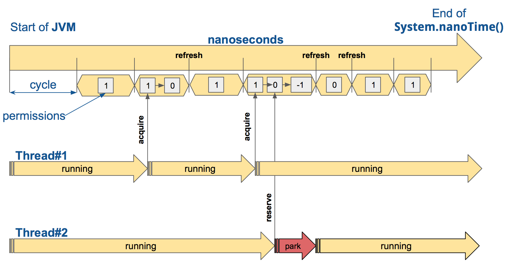

== Implementation details

=== CircuitBreaker

The CircuitBreaker is implemented via a finite state machine with three normal states: `CLOSED`, `OPEN` and `HALF_OPEN` and three special states `METRICS_ONLY`, `DISABLED` and `FORCED_OPEN`.

image::images/state_machine.jpg[]

The CircuitBreaker does not know anything about the backend's state by itself, but uses the information provided by the decorators via `CircuitBreaker::onSuccess` and `CircuitBreaker::onError`. See example:

[source,java]
----
static <T> Supplier<T> decorateSupplier(CircuitBreaker circuitBreaker, Supplier<T> supplier){
    return () -> {
        circuitBreaker.acquirePermission();
        long start = System.nanoTime();
        try {
            T returnValue = supplier.get();
            long durationInNanos = System.nanoTime() - start;
            circuitBreaker.onSuccess(durationInNanos);
            return returnValue;
        } catch (Throwable throwable) {
            long durationInNanos = System.nanoTime() - start;
            circuitBreaker.onError(durationInNanos, throwable);
            throw throwable;
        }
    };
}
----

The state of the CircuitBreaker changes from `CLOSED` to `OPEN` when the failure rate is above a (configurable) threshold.
Then, all access to the backend is blocked for a (configurable) time duration. `CircuitBreaker::acquirePermission()` throws a `CircuitBreakerOpenException`, if the CircuitBreaker is `OPEN`.

The CircuitBreaker uses a Ring Bit Buffer in the `CLOSED` state to store the success or failure statuses of the calls. A successful call is stored as a `0` bit and a failed call is stored as a `1` bit. The Ring Bit Buffer has a (configurable) fixed-size. The Ring Bit Buffer uses internally a https://docs.oracle.com/javase/8/docs/api/java/util/BitSet.html[BitSet] like data structure to store the bits which is saving memory compared to a boolean array. The BitSet uses a long[] array to store the bits. That means the BitSet only needs an array of 16 long (64-bit) values to store the status of 1024 calls.

image::images/ring_buffer.jpg[Ring Bit Buffer]

The Ring Bit Buffer must be full, before the failure rate can be calculated.
For example, if the size of the Ring Buffer is 10, then at least 10 calls must evaluated, before the failure rate can be calculated. If only 9 calls have been evaluated the CircuitBreaker will not trip open even if all 9 calls have failed.

After the time duration has elapsed, the CircuitBreaker state changes from `OPEN` to `HALF_OPEN` and allows calls to see if the backend is still unavailable or has become available again. The CircuitBreaker uses another (configurable) Ring Bit Buffer to evaluate the failure rate in the `HALF_OPEN` state. If the failure rate is above the configured threshold, the state changes back to `OPEN`. If the failure rate is below or equal to the threshold, the state changes back to `CLOSED`.
`CircuitBreaker::onError` checks if the exception should be recorded as a failure or should be ignored. You can configure a custom `Predicate` which decides whether an exception should be recorded as a failure. The default Predicate records all exceptions as a failure.

The CircuitBreaker supports resetting to its original state, losing all the metrics and resetting its Ring Bit Buffer.
[source,java]
----
CircuitBreaker circuitBreaker = CircuitBreaker.ofDefaults("testName");
circuitBreaker.reset();
----

The CircuitBreaker supports three more special states, `METRICS_ONLY` (always allow access), `DISABLED` (always allow access) and `FORCED_OPEN` (always deny access). In `METRICS_ONLY` state all Circuit Breaker events (except state transition) are generated and metrics are recorded, similar to `CLOSED` state but the only difference being, the circuit does not open when any of the thresholds are breached. In `DISABLED` and `FORCED_OPEN` states no CircuitBreakerEvents (apart from the state transition) are generated, and no metrics are recorded. The only way to exit from those states is to trigger a state transition or to reset the CircuitBreaker.

[source,java]
----
CircuitBreaker circuitBreaker = CircuitBreaker.ofDefaults("testName");
circuitBreaker.transitionToDisabledState();
// circuitBreaker.onFailure(...) won't trigger a state change
circuitBreaker.transitionToClosedState(); // will transition to CLOSED state and re-enable normal behaviour, keeping metrics
circuitBreaker.transitionToForcedOpenState();
// circuitBreaker.onSuccess(...) won't trigger a state change
circuitBreaker.reset(); //  will transition to CLOSED state and re-enable normal behaviour, losing metrics
----

The CircuitBreaker publishes a stream of CircuitBreakerEvents to any Subscriber/Consumer who subscribes. An event can be a state transition or a recorded error. This library uses RxJava to to provide this functionality. If you want to consume events, you have to subscribe to the event stream. This library provides a consumer `CircuitBreakerEventConsumer` which can be used to store events in a circular buffer with a fixed capacity. You can use RxJava to filter certain events.

[source,java]
----
CircuitBreaker circuitBreaker = CircuitBreaker.ofDefaults("testName");
CircuitBreakerEventConsumer ringBuffer = new CircuitBreakerEventConsumer(10);
circuitBreaker.getEventStream()
        .filter(event -> event.getEventType() == Type.ERROR)
        .subscribe(ringBuffer);
----

=== RateLimiter
Conceptually `RateLimiter` splits all nanoseconds from the start of epoch into cycles.
Each cycle has duration configured by `RateLimiterConfig.limitRefreshPeriod`.
By contract on start of each cycle `RateLimiter` should set `activePermissions` to `RateLimiterConfig.limitForPeriod`.
For the `RateLimiter` callers it is really looks so, but for example `AtomicRateLimiter` implementation has
some optimisations under the hood that will skip this refresh if `RateLimiter` is not used actively.

The default implementation of `RateLimiter` is `AtomicRateLimiter` it manages state via `AtomicReference`.
`AtomicRateLimiter.State` is completely immutable and has the folowing fields:

* `activeCycle` - cycle number that was used by the last call.
* `activePermissions` - count of available permissions after the last call.
Can be negative if some permissions where reserved.
* `nanosToWait` - count of nanoseconds to wait for permission for the last call.

`AtomicRateLimiter` is also very fast on i7-5557U processor and with x64 Java-1.8.0_112
it takes only `143±1 [ns]` to acquire permission.
So you can easily restrict not only network calls but your local in-memory operations, too.
