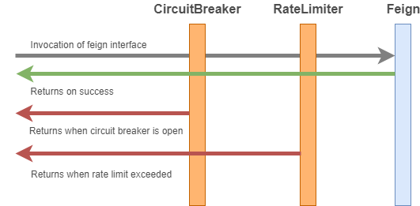

= resilience4j-feign

Resilience4j decorators for https://github.com/OpenFeign/feign[feign].
Similar to https://github.com/OpenFeign/feign/tree/master/hystrix[HystrixFeign], 
resilience4j-feign makes it easy to incorporate "fault tolerance" patterns into the feign framework, such as 
 the CircuitBreaker and RateLimiter. 


== Current Features
* CircuitBreaker
* RateLimiter
* Fallback
 
 
== Decorating Feign Interfaces

The `+Resilience4jFeign.capability+` is the main class for creating fault tolerance instances of feign.
It proves a mechanism to bind feign with resilience4j using the capabilities api implemented in feign 10.9.
Previous releases relied on Resilience4jFeign.builder, which used a mechanism that is no longer working since feign 12.5.
`+InvocationHandlerFactory+`. Resilience4jFeign uses its own `+InvocationHandlerFactory+` to apply the decorators.
Decorators can be built using the `+FeignDecorators+` class. Multiple decorators can be combined

The following example shows how to decorate a feign interface with a RateLimiter and CircuitBreaker:
``` java
        public interface MyService {
            @RequestLine("GET /greeting")
            String getGreeting();
            
            @RequestLine("POST /greeting")
            String createGreeting();
        }

        CircuitBreaker circuitBreaker = CircuitBreaker.ofDefaults("backendName");
        RateLimiter rateLimiter = RateLimiter.ofDefaults("backendName");
        FeignDecorators decorators = FeignDecorators.builder()
                                         .withRateLimiter(rateLimiter)
                                         .withCircuitBreaker(circuitBreaker)
                                         .build();
        MyService myService = Feign.builder()
                                .addCapability(Resilience4jFeign.capability(decorators))
                                .target(MyService.class, "http://localhost:8080/");
```

Calling any method of the `+MyService+` instance will invoke a CircuitBreaker and then a RateLimiter.
If one of these mechanisms take effect, then the corresponding RuntimeException will be thrown, for example, `+CallNotPermittedException+` or `+RequestNotPermitted+` (Hint: These do not extend the `+FeignException+` class).

The following diagram illustrates how the decorators are stacked:



== Ordering of Decorators
The order in which decorators are applied correspond to the order in which they are declared. 
When building `+FeignDecorators+`, it is important to be wary of this, since the order affects the resulting behavior.

For example,
``` java
        FeignDecorators decoratorsA = FeignDecorators.builder()
                                         .withCircuitBreaker(circuitBreaker)
                                         .withRateLimiter(rateLimiter)
                                         .build();
                                         
        FeignDecorators decoratorsB = FeignDecorators.builder()
                                         .withRateLimiter(rateLimiter)
                                         .withCircuitBreaker(circuitBreaker)
                                         .build();
```        

With `+decoratorsA+` the RateLimiter will be called before the CircuitBreaker. That means that even if the CircuitBreaker is open, the RateLimiter will still limit the rate of calls.
`+decoratorsB+` applies the reserve order. Meaning that once the CircuitBreaker is open, the RateLimiter will no longer be in affect.


== Fallback
Fallbacks can be defined that are called when Exceptions are thrown. Exceptions can occur when the HTTP request fails, but also when one of the `+FeignDecorators+` activates, for example, the CircuitBreaker.

``` java
        public interface MyService {
            @RequestLine("GET /greeting")
            String greeting();
        }

        MyService requestFailedFallback = () -> "fallback greeting";
        MyService circuitBreakerFallback = () -> "CircuitBreaker is open!";
        CircuitBreaker circuitBreaker = CircuitBreaker.ofDefaults("backendName");
        FeignDecorators decorators = FeignDecorators.builder()
                                         .withFallback(requestFailedFallback, FeignException.class)
                                         .withFallback(circuitBreakerFallback, CallNotPermittedException.class)
                                         .build();
        MyService myService = Feign.builder()
                                .addCapability(Resilience4jFeign.capability(decorators))
                                .target(MyService.class, "http://localhost:8080/", fallback);
```
In this example, the `+requestFailedFallback+` is called when a `+FeignException+` is thrown (usually when the HTTP request fails), whereas
 the `+circuitBreakerFallback+` is only called in the case of a `+CallNotPermittedException+`.
 Check the `+FeignDecorators+` class for more ways to filter fallbacks.

All fallbacks must implement the same interface that is declared in the "target" (Resilience4jFeign.Builder#target) method, otherwise an IllegalArgumentException will be thrown.
Multiple fallbacks can be assigned to handle the same Exception with the next fallback being called when the previous one fails.

A fallback can consume a thrown Exception if needed. This can be useful if the fallback may have different behaviours depending on the Exception, or to simply log the Exception.
Be aware that such a fallback will be instantiated for every exceptions thrown.

``` java
        public interface MyService {
            @RequestLine("GET /greeting")
            String greeting();
        }

        public class MyFallback implements MyService {
            private Exception cause;

            public MyFallback(Exception cause) {
                this.cause = cause;
            }

            public String greeting() {
                if (cause instanceOf FeignException) {
                    return "Feign Exception";
                } else {
                    return "Other exception";
                }
            }
        }

        FeignDecorators decorators = FeignDecorators.builder()
                                         .withFallbackFactory(MyFallback::new)
                                         .build();
```

== License

Copyright 2018

Licensed under the Apache License, Version 2.0 (the "License"); you may not use this file except in compliance with the License. You may obtain a copy of the License at

    http://www.apache.org/licenses/LICENSE-2.0

Unless required by applicable law or agreed to in writing, software distributed under the License is distributed on an "AS IS" BASIS, WITHOUT WARRANTIES OR CONDITIONS OF ANY KIND, either express or implied. See the License for the specific language governing permissions and limitations under the License.
